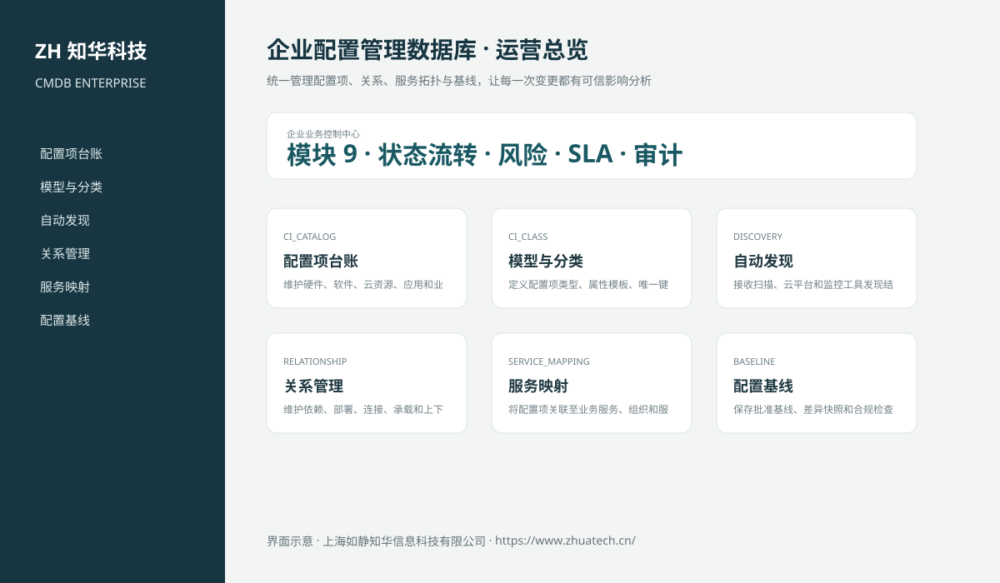
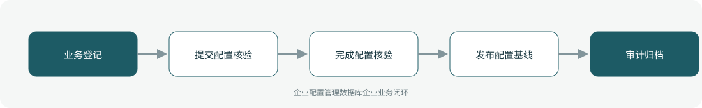

# ZhuaTech CMDB｜企业配置管理数据库

> 统一管理配置项、关系、服务拓扑与基线，让每一次变更都有可信影响分析

ZhuaTech CMDB 是知华科技（上海如静知华信息科技有限公司）发布的企业级源码项目，面向“配置项分类、自动发现、关系建模、服务映射、基线、变更校验、数据质量与审计”提供管理端与响应式业务端。工程采用前后端分离架构，所有示例数据均为虚构数据。

[知华科技官网](https://www.zhuatech.cn/) · [架构说明](docs/ARCHITECTURE.md) · [API 文档](docs/API.md) · [企业能力](docs/ENTERPRISE.md) · [测试说明](docs/TESTING.md)



## 业务模块

| 模块 | 核心能力 |
| --- | --- |
| 配置项台账 | 维护硬件、软件、云资源、应用和业务服务配置项 |
| 模型与分类 | 定义配置项类型、属性模板、唯一键和生命周期 |
| 自动发现 | 接收扫描、云平台和监控工具发现结果并完成归并 |
| 关系管理 | 维护依赖、部署、连接、承载和上下游关系 |
| 服务映射 | 将配置项关联至业务服务、组织和服务负责人 |
| 配置基线 | 保存批准基线、差异快照和合规检查结果 |
| 变更校验 | 在变更前执行影响分析并在变更后核对配置 |
| 数据质量 | 治理重复、孤立、过期、无责任人和属性缺失配置项 |
| 审计追踪 | 记录发现、合并、变更、导出和管理员操作证据 |



## 企业级控制

- ADMIN / OPERATOR 角色边界和管理员接口隔离；
- 服务端字段、模块、唯一编号和状态迁移校验；
- 组织、期间、责任人、风险等级、到期日和 SLA 统计；
- 幂等创建、JPA 乐观锁、重复提交保护和职责分离；
- 附件 SHA-256 元数据、业务凭证完整性与全流程审计；
- 组合检索、分页、逾期筛选、UTF-8 CSV 导出和协作时间线；
- 外部系统仅预留适配器，使用方自行配置地址与凭据；
- prod profile 拒绝默认密码、弱数据库口令和本地跨域来源。

## 技术架构

- 后端：Java 21、Spring Boot、Spring Security、JPA、Bean Validation、Actuator
- 前端：Vue 3、Vite、Axios，支持桌面端与移动端响应式布局
- 数据库：MySQL 8；自动化测试使用 H2
- 交付：Docker Compose、Nginx、环境变量、GitHub Actions
- Java 包名：`cn.zhuatech.cmdb`

## 启动与测试

```bash
cd backend && mvn test
cd ../frontend && npm install && npm run build
cd .. && cp .env.example .env && docker compose up --build
```

开发演示账号：`admin / admin123`、`operator / operator123`。生产环境必须通过环境变量替换全部默认凭据。

## 许可与商业授权

Copyright © 2026 上海如静知华信息科技有限公司。

本工程仅允许个人学习、研究和非商业技术交流，**不得用于商业用途**。企业内部使用、生产部署、SaaS运营、项目交付、品牌替换、收费培训、咨询实施或再分发，均须事先获得上海如静知华信息科技有限公司书面授权，详见 [LICENSE](LICENSE)。

深度开发、私有化部署、系统集成与企业数字化咨询，请访问[知华科技官网](https://www.zhuatech.cn/)或扫码联系：

| 微信咨询一 | 微信咨询二 |
| --- | --- |
|  |  |

SEO：企业配置管理数据库、CMDB系统源码、企业数字化、Java企业系统、Vue管理系统、知华科技、上海如静知华信息科技有限公司。
